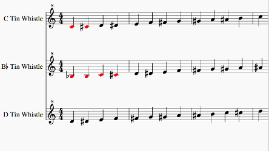
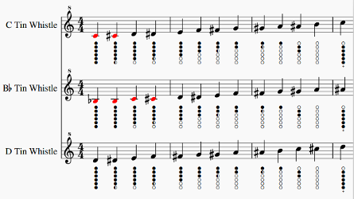

# tin-whistle-tablature

MuseScore plugin to add tablature (fingering) diagrams to a tin whistle staff in a score

### Introduction
This provides a plugin to automatically add fingering / tab diagrams to the notes in scores for tin whistle. The plugin will adjust for tin whistles tuned to D, C and Bb, according to the instrument defined for each staff. Note that if the staff instrument is not a whistle then no tabs are applied, otherwise the plugin will adjust the tab diagram position for the lowest note possible (currently D, C or Bb).

### Installation
* [Download plugin](https://github.com/jgadsden/tin-whistle-tablature/archive/version2.zip) for MuseScore version 2.

* Install using the [instructions](https://musescore.org/en/handbook/plugins#installation) in the MuseScore 2.x Handbook, which typically involves copying the QML file to the local MuseScore Plugin directory.

* Open MuseScore and navigate to ['Plugins' -> 'Plugin Manager'](https://musescore.org/en/handbook/plugins#enable-disable-plugins) to enable the plugin. Tick the box against 'tin\_whistle\_tablature' and apply with 'OK'.

* This plugin relies on a font being installed, which is not included in this download but can be obtained from [Blayne Chastain's site](https://www.blaynechastain.com/wp-content/uploads/TinWhistleTab.zip) . To install the font it is usually just a case of double-clicking the downloaded .ttf file and agreeing to the install process. If that does not work then on linux systems try copying the TinWhistleTab.ttf font file to /usr/share/fonts/truetype/.

### Using the plugin
The tabs will be added to the highlighted bars if you have made a selection, otherwise the whole score will have tabs added. Here is an example score before applying the tabs:

When you wish to apply the tabs then navigate to 'Plugins' -> 'Tin Whistle' -> 'Add tablature'. Here is the score with the tabs now applied:

You can back out by navigating to 'Edit' -> 'Undo'.

### Other stuff
MuseScore Plugin API compatibility: 2.x

Code repository: https://github.com/jgadsden/tin-whistle-tablature/

Issues: https://github.com/jgadsden/tin-whistle-tablature/issues

License: https://github.com/jgadsden/tin-whistle-tablature/blob/master/LICENSE

Upload from: https://github.com/jgadsden/tin-whistle-tablature/archive/version2.zip
