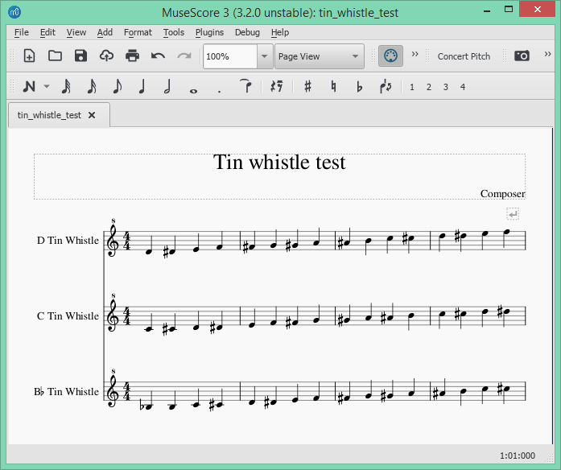

## tin-whistle-tablature
Source code for the [MuseScore plugin](https://musescore.org/en/project/tin-whistle-tablature)
which adds tablature / finger diagrams to a tin whistle staff in a score.

### Introduction
This provides a plugin to automatically add fingering / tab diagrams to the
notes in scores for tin whistle. The plugin will adjust for tin whistles tuned
to D, C and B♭, according to the instrument defined for each staff. Note that
if the staff instrument is not a whistle then no tabs are applied, otherwise the
plugin will adjust the tab diagram position for the lowest note possible.

MuseScore instrument files for
[versions 2.x and 3.x](https://github.com/jgadsden/tin-whistle-tablature/releases/download/v3.4/all-whistles.xml),
and [versions 4.x](https://github.com/jgadsden/tin-whistle-tablature/releases/download/v4.0/all-whistles-v4.xml),
can be used to provide tuning for tin whistles F, G, E♭ and also for low whistles tuned to D, F, G.

See the "Here be Dragons" section of this document that discusses various
quirks related to early MuseScore 3 releases.

### Installation
* For MuseScore 4 download the [plugin file](https://github.com/jgadsden/tin-whistle-tablature/releases/download/v4.0/tin_whistle_tablature.qml)
and copy it to directory `Documents/MuseScore4/Plugins/`

* If using MuseScore 3 version 3.4 or later then download this [plugin file](https://github.com/jgadsden/tin-whistle-tablature/releases/download/v3.4/tin_whistle_tablature.qml)

* If using MuseScore 3 version 3.3 or earlier then download a different [plugin file](https://github.com/jgadsden/tin-whistle-tablature/releases/download/v3.2/tin_whistle_tablature.qml)

* Alternatively if using the older MuseScore version 2 then use this [plugin](https://github.com/jgadsden/tin-whistle-tablature/releases/download/v2.3.2/tin_whistle_tablature.qml)

* Install using the [instructions](https://musescore.org/en/handbook/3/plugins#installation) in the MuseScore 3.x Handbook, which typically 
involves copying the QML file to the local MuseScore Plugin directory. If you 
are using MuseScore version 2.x then use this [handbook](https://musescore.org/en/handbook/plugins#installation) instead.

* Open MuseScore and navigate to 'Plugins' -> ['Plugin Manager'](https://musescore.org/en/handbook/3/plugins#enable-disable-plugins)
to enable the plugin. Tick the box against 'tin\_whistle\_tablature' and apply
with 'OK'.

### Installing Font
This plugin relies on a tin whistle tablature font being installed from 
[Blayne Chastain's site](https://www.blaynechastain.com/wp-content/uploads/TinWhistleTab.zip).
You can also download it from our [release area](https://github.com/jgadsden/tin-whistle-tablature/releases/download/v4.0/TinWhistleTab.ttf).

If the font isn't installed you will be presented with a message box telling you 
how to obtain the font. To install the font, it is usually just a case of double-clicking 
the downloaded `.ttf` file and agreeing to the install process. If that does not work then 
on linux systems try copying the TinWhistleTab.ttf font file to the `/usr/share/fonts/truetype/` directory.
However, if you are installing the font on a Windows 10 system you will need to ensure you install the font
for "all users". You can do this by right clicking on the file and selecting "Install for all users"
as illustrated here:

 

 For more information on this Windows 10 font problem and solutions see issue
 [musescore/MuseScore#6084](https://github.com/musescore/MuseScore/pull/6084) and
 [how-to-force-win10-to-install-fonts-in-c-windows-fonts](https://stackoverflow.com/questions/55264642/how-to-force-win10-to-install-fonts-in-c-windows-fonts).

### Using the plugin
The tabs will be added to the highlighted bars if you have made a selection,
otherwise the whole score will have tabs added. Here is an example score before
applying the tabs:

When you wish to apply the tabs then navigate to 'Plugins' -> 'Tin Whistle' ->
'Add tablature'. Here is the score with the tabs now applied:

and the equivelent if using MuseScore 2 :

You can back out by navigating to 'Edit' -> 'Undo'.

### Here be Dragons
The version for MuseScore 2 will check that the staff is for a tin whistle and
adjust the tab diagram position for the lowest note possible.

Prior to MuseScore 3.2:

* The instrument type used on a staff can NOT be detected. In this case the plugin will 
assume that a whistle tuned to D is used - this being the most common whistle. 

* This plugin only supports grace notes that lead the main note. Tabs for trailing grace 
notes will be rendered as leading notes which is not what you want. In fact the trailing 
notes will be out of order. 

Prior to MuseScore 3.3:

* You may see some minor issues with grace note tab positioning. The actual physical 
position of the grace notes was not available before v3.3 so a heuristic approach 
(aka good 'ole human observation) is used to get a decent overall result even though 
it's not perfect.

Here is an example of how the fingering tab images are accurately positioned in MuseScore 3.3+:

### Having problems?
Note that this plugin relies on a font being installed, see the 'Installating font'
instructions.

The plugin will skip any staffs that are not for a Tin Whistle, so for example
if the staff is for the Irish Flute then it will not apply the tabs. This makes
sense as other instrument's fingering will be different.

## Extra Tin Whistle and Low Whistle Tunings
The files `all-whistles.xml` and `all-whistles-v4.xml` are extra instrument files
for adding both High Tin Whistle types and Low Whistle types to MuseScore.  
MuseScore comes with whistles D, C and B♭ by default but you may want to use other tunings.

The High Tin Whistle, which is a metal 6 hole Flageolet, comes in various tunings.
These are listed in order of decreasing physical size:
* "B♭ Tin Whistle" tuned to key B♭, also used for keys Cm and E♭
* "C Tin Whistle" tuned to C, also for Dm and F
* "D Tin Whistle" tuned to D, also for Em and G
* "E♭ Tin Whistle" tuned to E♭, also for Fm and A♭
* "F Tin Whistle" tuned to F, also for Gm (F can be played on a C whistle)
* "G Tin Whistle" tuned to G, also for Am (G can be played on a D whistle)

Tuning to D is by far the most common, so "Tin Whistle" is the same as "D Tin Whistle".

The Low Whistle is larger than the more well-known tin whistle and has a lower pitch.
This whistle is commonly available in three tunings:
* "D Low Whistle" tuned to D4, also used for keys Em and G
* "F Low Whistle" tuned to F4, also used for Gm and B♭
* "G Low Whistle" tuned to G4, also used for Am and C

### Install for extra whistles
The file `all-whistles.xml` or `all-whistles-v4.xml` needs to be installed using the MuseScore menu.

#### Install for MuseScore 4.x
Download the `all-whistles-v4.xml`
[instrument extension file](https://github.com/jgadsden/tin-whistle-tablature/releases/download/v4.0/all-whistles-v4.xml)
to your operating system.

1. Start Version 4.x Musescore
2. use the drop down menus to navigate 'MuseScore' then 'Preferences...' then 'Score' panel
3. Use the file icon beside 'Score Order List 2:' to select the downloaded `all-whistles.xml` file
4. Accept the changes using the OK button

You can now add a tin/low whistle staff to your score using the 'Instruments' tab and 'Add' button.
Note that these whistles appear in the 'World Music' genre, not the 'Common' genre.

#### Install for MuseScore 2.x and  MuseScore 3.x
Download the `all-whistles.xml`
[instrument extension file](https://github.com/jgadsden/tin-whistle-tablature/releases/download/v3.4/all-whistles.xml)
to your operating system.  
Use the same file for both MuseScore version 2.x and version 3.x :

1. Either MuseScore 2.x: copy file `all-whistles.xml` to `Documents/MuseScore2/Extensions/all-whistles.xml` 
2. Or for  MuseScore 3.x: copy file `all-whistles.xml` to `Documents/MuseScore3/Extensions/all-whistles.xml`
3. within Musescore menu, navigate to 'MuseScore' then 'Preferences...' then 'Score' tab
4. in the Default Files panel, add the file to 'Instrument List 2' extension by:
5. browsing to `Documents/MuseScore3/Extensions/all-whistles.xml` and add to 'Instrument List 2'
6. Accept the changes with the OK button

You may now add a tin whistle staff using MuseScore menu item 'Edit' then 'Instruments...', 
where MuseScore lists these extra instruments under 'World Music' 'Woodwinds'.

Once a tin whistle staff is added to the score there is no need to keep the instrument
file `all-whistles.xml` in the 'Instrument List 2' extension.

## Examples

The score `examples/tin_whistle_range_test.mscz` is an example showing all the High Tin Whistle staves.  
The score `examples/low_whistle_range_test.mscz` shows all three Low Whistle staves.

#### Other stuff
MuseScore Plugin API compatibility: 2.x, 3.x, 4.x

Issues: https://github.com/jgadsden/tin-whistle-tablature/issues

MuseScore issue tracker: https://musescore.org/en/project/issues/TinWhistleTablature

License: https://raw.githubusercontent.com/jgadsden/tin-whistle-tablature/main/LICENSE

Code repository: https://github.com/jgadsden/tin-whistle-tablature/

There are three branches for this plugin in the code repository:
* one for MuseScore 2.x on a branch 'version2'
* one for MuseScore 2.x on a branch 'version3'
* the 'main' branch is for MuseScore 4.x
